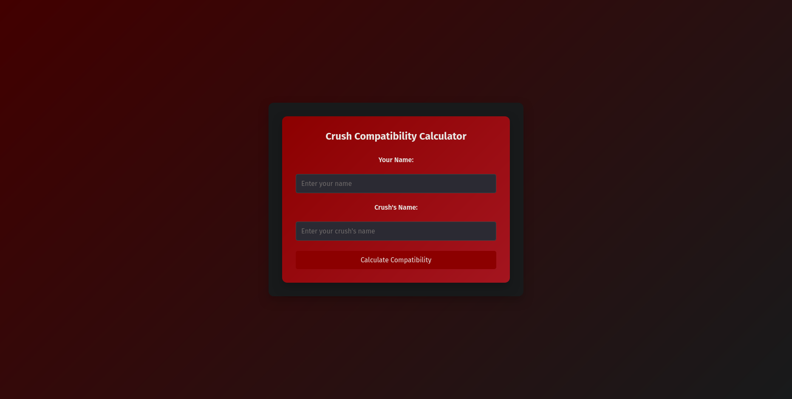
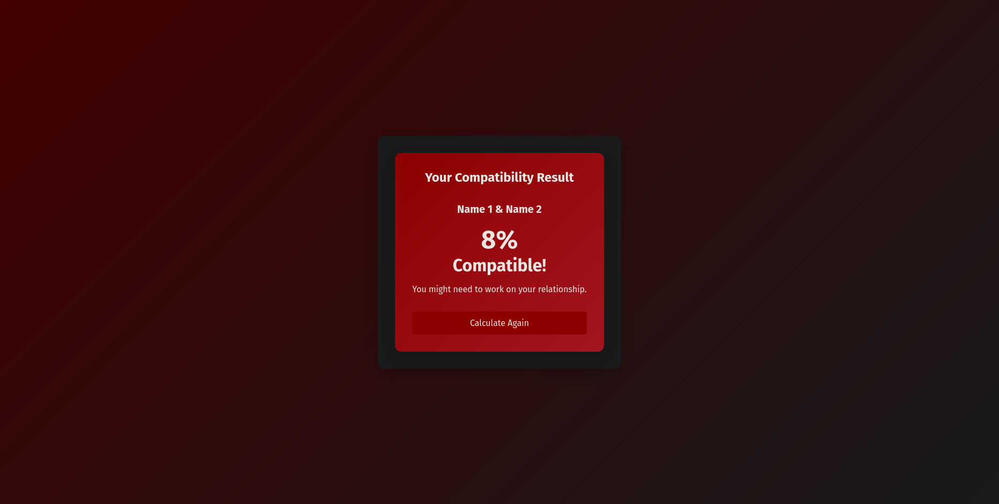

# Compat Calc

Welcome to the Compat Calc project! This application is hosted on [Vercel](https://crush-compat-calc.vercel.app/).

## Overview

Compat Calc is a fun compatibility calculator that randomly generates a compatibility percentage between two individuals. The result is stored in a PostgreSQL database, ensuring that if you enter the same names in the same order, the same result will always be displayed.

## Features

- User-friendly interface
- Random compatibility calculation
- Consistent results via PostgreSQL storage

## Installation

To run this project locally using Flask, follow these steps:
### Windows

1. Clone the repository:
    ```powershell
    git clone https://github.com/yourusername/compat-calc.git
    ```
2. Navigate to the project directory:
    ```powershell
    cd compat-calc
    ```
3. Create a virtual environment:
    ```powershell
    python -m venv venv
    ```
4. Activate the virtual environment:
    ```powershell
    .\venv\scripts\activate.ps1
    ```
5. Install the dependencies:
    ```powershell
    pip install -r requirements.txt
    ```
6. Create a `.env` file in the project root directory and add the following content:
    ```properties
    DATABASE_URL = "your_postgres_url"
    stored_password = 'md5_hash_of_password'  # md5 hash of 'password' you wish to set.
    ```

7. Start the Flask development server:
    ```powershell
    flask run
    ```

### macOS and Linux

1. Clone the repository:
    ```bash
    git clone https://github.com/yourusername/compat-calc.git
    ```
2. Navigate to the project directory:
    ```bash
    cd compat-calc
    ```
3. Create a virtual environment:
    ```bash
    python3 -m venv venv
    ```
4. Activate the virtual environment:
    ```bash
    source venv/bin/activate
    ```
5. Install the dependencies:
    ```bash
    pip install -r requirements.txt
    ```
6. Create a `.env` file in the project root directory and add the following content:
    ```properties
    DATABASE_URL = "your_postgres_url"
    stored_password = 'md5_hash_of_password'  # md5 hash of 'password' you wish to set.
    ```

7. Start the Flask development server:
    ```bash
    flask run
    ```

## Usage

Visit the hosted application at [https://crush-compat-calc.vercel.app/](https://crush-compat-calc.vercel.app/) and enter the names to calculate compatibility. The compatibility percentage is generated randomly and stored in a PostgreSQL database, ensuring that entering the same names in the same order will always yield the same result.




## Contributing

Contributions are welcome! Please fork the repository and create a pull request with your changes.

## License

This project is licensed under the [MIT License](./LICENSE).

## Contact

For any questions or feedback, please contact [mohammedshadin65@proton.me](mailto:mohammedshadin65@proton.me).